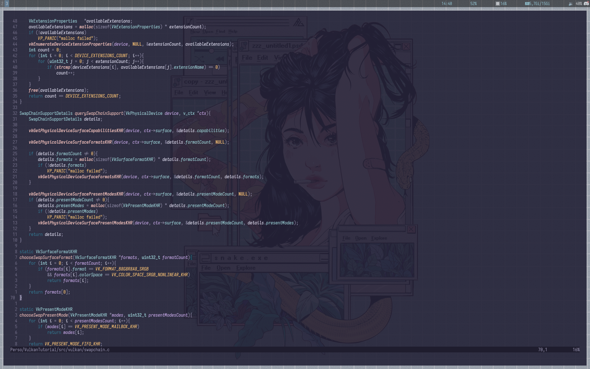
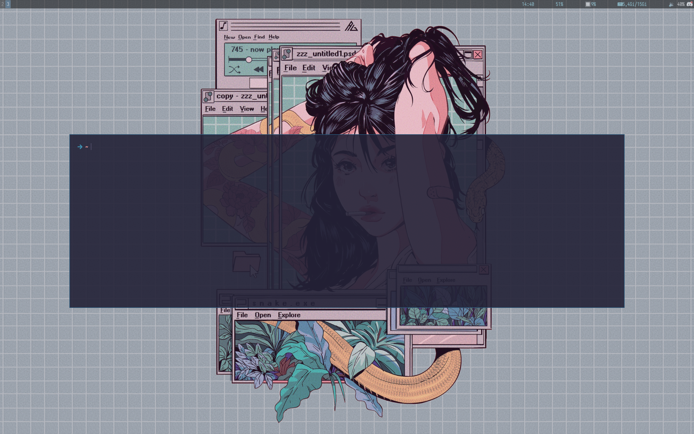

This is my config, i use i3 + endeavour os.

For nvim i use: https://github.con/bonsthie/nvim   
For rofi i use one of these theme with a rose-pine color: https://github.com/adi1090x/rofi   

### Examples:

